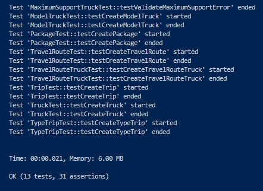

# Sistema de mensajeria

Este sistema se encarga de crear y vincular paquetes agrupados en un conjunto de viajes realizados por un camion de la mensajeria.

Instalacion
------------
Primero, necesita descargar e instalar [Composer](http://getcomposer.org/).

Luego debe ejecutar el comando

```sh
composer install
```

Configuracion
------------
Existen cuatro tipo de logica configurable, las cuales hacen referencia a los costos de cada viaje dependiendo su prioridad/urgencia

* COST_TRIP_NORMAL
* COST_TRIP_PRIORITY_KG
* COST_TRIP_PRIORITY_VOLUME
* COST_TRIP_REFUND

Las mismas pueden ser modificadas desde un solo lado para que el sistema tome sus valores de manera global.

Esto se hace desde el archivo constants.php que se encuentra en la raiz del aplicativo

```sh
define('COST_TRIP_NORMAL', 2);
define('COST_TRIP_PRIORITY_KG', 4);
define('COST_TRIP_PRIORITY_VOLUME', 10);
define('COST_TRIP_REFUND', 1000);
```

## PHPUnit Test
Para validar que el sistema este funcionando correctamente, contamos con Test unitarios para cada funcionalidad del sistema.

Puede ejecutar todas las pruebas utilizando el siguiente comando

```sh
./vendor/bin/phpunit --verbose --debug tests
```
Deberia dar un total de 13 Test y 31 afirmaciones

